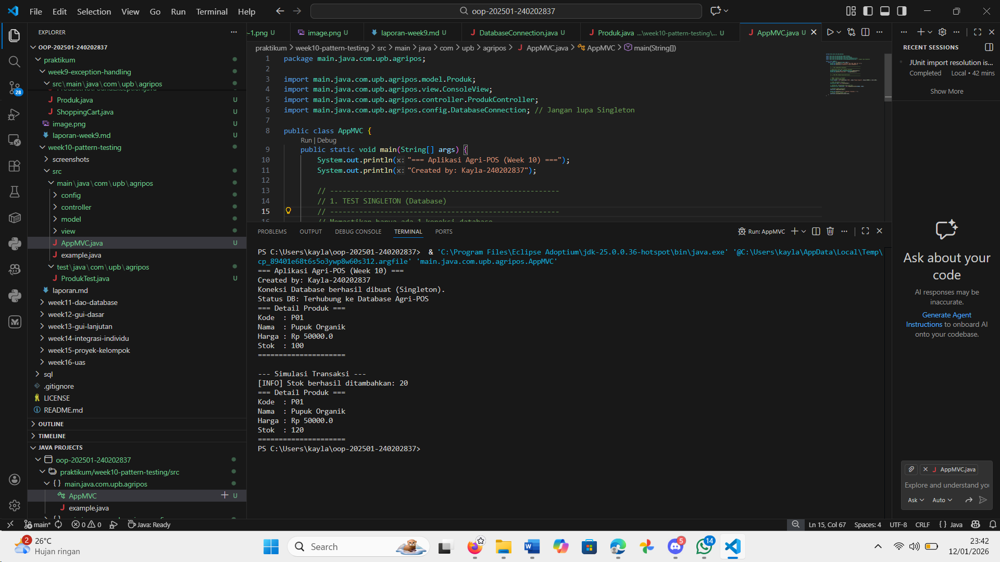
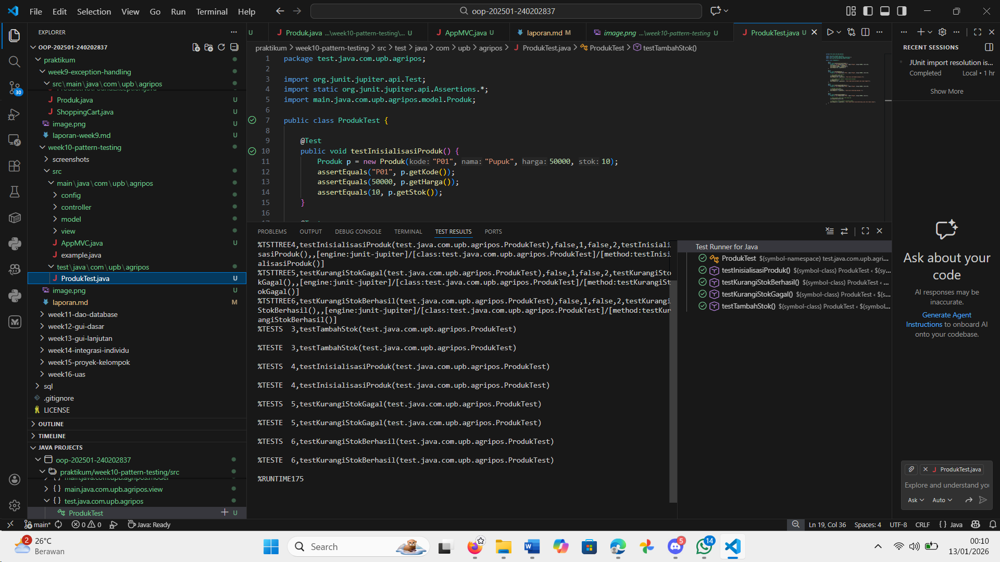

# Laporan Praktikum Minggu 10
Topik: Design Pattern (Singleton, MVC) dan Unit Testing menggunakan JUnit

## Identitas
- Nama  : Kayla putri arsonisr
- NIM   : 240202837
- Kelas : 3IKRA

---

## Tujuan
1. Menjelaskan konsep dasar design pattern dalam rekayasa perangkat lunak.
2. Mengimplementasikan Singleton Pattern untuk manajemen koneksi database.
3. Menerapkan arsitektur MVC (Model–View–Controller) pada fitur Produk.
4. Membuat dan menjalankan unit test otomatis menggunakan JUnit.
5. Menganalisis manfaat penerapan design pattern terhadap struktur kode.

---

## Dasar Teori
1. Design Pattern: Solusi umum yang dapat digunakan kembali untuk masalah yang sering muncul dalam desain perangkat lunak.
2. Singleton Pattern: Pola desain yang memastikan sebuah kelas hanya memiliki satu instance dan menyediakan satu titik akses global ke instance tersebut. Ciri khasnya adalah konstruktor bersifat private.
3. MVC (Model-View-Controller): Pola arsitektur yang memisahkan aplikasi menjadi tiga komponen utama:
   a. Model: Menangani data dan logika bisnis (contoh: Produk).
   b. View: Menangani tampilan/output ke pengguna (contoh: ConsoleView).
   c. Controller: Menghubungkan Model dan View serta menangani input (contoh: ProdukController).
4. Unit Testing: Pengujian perangkat lunak pada unit terkecil (seperti method atau class) secara terisolasi untuk memastikan kode berjalan sesuai spesifikasi.

---

## Langkah Praktikum
1. Setup Project: Membuat struktur package com.upb.agripos yang terdiri dari sub-package config, controller, model, dan view.
2. Implementasi Singleton: Membuat kelas DatabaseConnection dengan konstruktor private dan method static getInstance().
3. Implementasi MVC:
   a. Membuat Model Produk dengan atribut kode, nama, harga, dan stok.
   b. Membuat ConsoleView untuk menampilkan data ke terminal.
   c.  Membuat ProdukController untuk mengatur alur data antara Model dan View.
4. Integrasi: Menyatukan semua komponen dalam class AppMVC untuk simulasi transaksi.
5. Unit Testing: Menambahkan library JUnit 5 ke dalam project dan membuat class ProdukTest untuk menguji logika tambah dan kurangi stok.

---

## Kode Program
1. Singleton (DatabaseConnection.java)
Java

package com.upb.agripos.config;

public class DatabaseConnection {
    private static DatabaseConnection instance;

    private DatabaseConnection() {
        System.out.println("Koneksi Database berhasil dibuat (Singleton).");
    }

    public static DatabaseConnection getInstance() {
        if (instance == null) {
            instance = new DatabaseConnection();
        }
        return instance;
    }
    
    public String getStatus() {
        return "Terhubung ke Database Agri POS";
    }
}

2. Model (Produk.java)
Java

package com.upb.agripos.model;

public class Produk {
    private String kode;
    private String nama;
    private double harga;
    private int stok;

    public Produk(String kode, String nama, double harga, int stok) {
        this.kode = kode;
        this.nama = nama;
        this.harga = harga;
        this.stok = stok;
    }
    
    // Getter dan Setter...

    public void tambahStok(int jumlah) {
        if (jumlah > 0) this.stok += jumlah;
    }

    public void kurangiStok(int jumlah) {
        if (this.stok >= jumlah) this.stok -= jumlah;
    }
}

3. Controller (ProdukController.java)
Java

package com.upb.agripos.controller;

import com.upb.agripos.model.Produk;
import com.upb.agripos.view.ConsoleView;

public class ProdukController {
    private final Produk model;
    private final ConsoleView view;

    public ProdukController(Produk model, ConsoleView view) {
        this.model = model;
        this.view = view;
    }

    public void tampilkanProduk() {
        view.showProductDetails(model);
    }

    public void prosesRestock(int jumlah) {
        model.tambahStok(jumlah);
        view.showMessage("Stok berhasil ditambahkan: " + jumlah);
        tampilkanProduk();
    }
}

4. Unit Test (ProdukTest.java)
Java

package com.upb.agripos;

import org.junit.jupiter.api.Test;
import static org.junit.jupiter.api.Assertions.*;
import com.upb.agripos.model.Produk;

public class ProdukTest {
    @Test
    public void testTambahStok() {
        Produk p = new Produk("P01", "Pupuk", 50000, 10);
        p.tambahStok(5);
        assertEquals(15, p.getStok(), "Stok harus bertambah menjadi 15");
    }
}

---

## Hasil Eksekusi
 

---

## Analisis
Pada praktikum ini, kode berjalan dengan menginisialisasi DatabaseConnection terlebih dahulu. Karena menggunakan pola Singleton, pesan "Koneksi Database berhasil dibuat" hanya muncul satu kali meskipun dipanggil berulang-ulang, yang membuktikan efisiensi memori.

Selanjutnya, pola MVC memisahkan tugas dengan jelas: AppMVC tidak langsung mencetak data produk, melainkan meminta ProdukController untuk melakukannya. Controller mengambil data dari Produk dan menyerahkannya ke ConsoleView untuk ditampilkan.

Kendala yang dihadapi: Saya sempat mengalami error ClassNotFoundException dan masalah library JUnit yang tidak terdeteksi. Penyebab utamanya adalah kesalahan penulisan struktur package yang menyertakan folder root (main.java.com...). Solusi: Saya memperbaiki deklarasi package menjadi com.upb.agripos di semua file, melakukan Clean Java Language Server Workspace di VS Code, dan menambahkan library JUnit secara manual ke Referenced Libraries.

---

## Kesimpulan
Penerapan Design Pattern dan Unit Testing sangat penting untuk menjaga kualitas perangkat lunak. Singleton mencegah pemborosan resource pada koneksi database. MVC membuat kode lebih rapi dan mudah dirawat karena pemisahan logika dan tampilan. Unit Testing dengan JUnit memberikan jaminan bahwa logika bisnis (seperti perhitungan stok) berjalan benar sebelum aplikasi dirilis.

---

## Quiz
1. Mengapa constructor pada Singleton harus bersifat private? 
Jawaban: Agar kelas lain tidak dapat membuat instance baru secara langsung menggunakan keyword new. Hal ini memaksa penggunaan method getInstance() untuk memastikan hanya ada satu objek yang tercipta.
2. Jelaskan manfaat pemisahan Model, View, dan Controller. 
Jawaban: Memudahkan maintenance (perawatan kode), memungkinkan pengembangan paralel (frontend dan backend bekerja terpisah), dan meningkatkan reusability (kode Model bisa dipakai ulang oleh View yang berbeda).
3. Apa peran unit testing dalam menjaga kualitas perangkat lunak? 
Jawaban: Unit testing mendeteksi bug atau kesalahan logika sejak dini pada level komponen terkecil, serta memastikan perubahan kode baru tidak merusak fitur yang sudah berjalan (regression testing).
4. Apa risiko jika Singleton tidak diimplementasikan dengan benar? 
Jawaban: Pada lingkungan multi-thread, bisa terjadi race condition di mana dua thread menciptakan dua objek berbeda secara bersamaan, sehingga melanggar prinsip tunggal Singleton dan memboroskan memori.