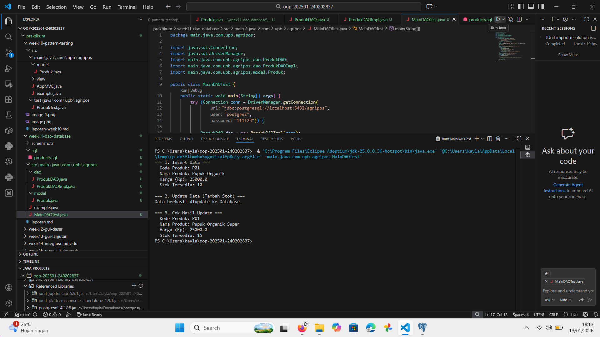

# Laporan Praktikum Minggu 11
Topik: Data Access Object (DAO) dan CRUD Database dengan JDBC

## Identitas
- Nama  : kayla putri arsonisr
- NIM   : 240202837
- Kelas : 3IKRA

---

## Tujuan
1. Menjelaskan konsep Data Access Object (DAO) untuk memisahkan logika bisnis dan akses data.
2. Menghubungkan aplikasi Java dengan basis data PostgreSQL menggunakan JDBC.
3. Mengimplementasikan operasi CRUD (Create, Read, Update, Delete) secara lengkap.
4.  Mengintegrasikan DAO dengan class aplikasi utama (MainDAOTest).

---

## Dasar Teori
1. Data Access Object (DAO): Merupakan pola desain (design pattern) yang menyediakan antarmuka abstrak ke semacam database atau mekanisme persistensi lainnya. Tujuannya adalah memisahkan logika akses data tingkat rendah dari logika bisnis tingkat tinggi.
2. JDBC (Java Database Connectivity): Sebuah standar API Java yang memungkinkan aplikasi Java untuk berinteraksi dengan berbagai jenis basis data relasional. Komponen utamanya meliputi DriverManager, Connection, PreparedStatement, dan ResultSet.
3. PreparedStatement: Salah satu fitur JDBC untuk mengeksekusi query SQL. Berbeda dengan Statement biasa, PreparedStatement lebih aman dari serangan SQL Injection karena parameter query dipisahkan dari perintah SQL itu sendiri.

---

## Langkah Praktikum
1. Persiapan Database:
   a. Menginstal PostgreSQL dan pgAdmin 4.
   b. Membuat database agripos.
   c. Membuat tabel products menggunakan Query Tool di pgAdmin.
2. Konfigurasi Project di VS Code:
   a. Menyiapkan struktur folder package com.upb.agripos.
   b. Mendownload dan menambahkan library driver JDBC (postgresql-42.7.8.jar) ke Referenced Libraries agar Java bisa mengenali PostgreSQL.
3. Implementasi Kode:
   a. Membuat class Model Produk.java.
   b. Membuat interface ProdukDAO.java.
   c. Membuat implementasi ProdukDAOImpl.java berisi query SQL (INSERT, SELECT, UPDATE, DELETE).
   d. Membuat class utama MainDAOTest.java untuk pengujian.
4. Eksekusi: Menjalankan MainDAOTest dan memverifikasi output di terminal serta perubahan data di pgAdmin.

---

## Kode Program
1. Model (Produk.java)
Java

package com.upb.agripos.model;
// Class representasi tabel products
public class Produk {
    private String kode;
    private String nama;
    private double harga;
    private int stok;
    
    // Constructor, Getter, Setter, dan method logika bisnis (tambahStok)
    // ... (kode lengkap ada di file project)
}

2. DAO Implementation (ProdukDAOImpl.java)
Java

package com.upb.agripos.dao;
import java.sql.*;
// ... imports

public class ProdukDAOImpl implements ProdukDAO {
    private final Connection connection;

    public ProdukDAOImpl(Connection connection) {
        this.connection = connection;
    }

    @Override
    public void insert(Produk p) throws Exception {
        String sql = "INSERT INTO products(code, name, price, stock) VALUES (?, ?, ?, ?)";
        try (PreparedStatement ps = connection.prepareStatement(sql)) {
            ps.setString(1, p.getKode());
            ps.setString(2, p.getNama());
            ps.setDouble(3, p.getHarga());
            ps.setInt(4, p.getStok());
            ps.executeUpdate();
        }
    }
    // ... method CRUD lainnya (update, delete, findByKode, findAll)
}

3. Main Test (MainDAOTest.java)
Java

package com.upb.agripos;
import java.sql.Connection;
import java.sql.DriverManager;
// ... imports

public class MainDAOTest {
    public static void main(String[] args) {
        // Membuka koneksi ke database agripos
        try (Connection conn = DriverManager.getConnection(
                "jdbc:postgresql://localhost:5432/agripos", 
                "postgres", "111123")) {

            ProdukDAO dao = new ProdukDAOImpl(conn);
            
            // Test Insert
            dao.insert(new Produk("P01", "Pupuk Organik", 25000, 10));
            
            // Test Update & Logika Bisnis
            Produk p = dao.findByKode("P01");
            p.tambahStok(5);
            dao.update(p);
            
            // Cek Hasil
            System.out.println("Data berhasil diupdate ke Database.");
        } catch (Exception e) {
            e.printStackTrace();
        }
    }
}

---

## Hasil Eksekusi

---

## Analisis
1. Alur Program: Program dimulai dengan membuka koneksi ke database menggunakan DriverManager. Koneksi ini kemudian diserahkan ke ProdukDAOImpl. Ketika MainDAOTest memanggil method seperti dao.insert(), aplikasi mengirimkan perintah SQL ke PostgreSQL, yang kemudian menyimpan data secara permanen.
2. Perbedaan dari Minggu Sebelumnya: Pada minggu-minggu sebelumnya, data disimpan di dalam ArrayList (memori sementara). Jika aplikasi ditutup, data hilang. Minggu ini, data disimpan di Database. Meskipun aplikasi ditutup dan dijalankan ulang, data tetap ada (persisten).
3. Kendala & Solusi:
   a. Kendala: Sempat terjadi error java.sql.SQLException: No suitable driver found.
   b. Penyebab: Library JDBC Driver PostgreSQL belum dimasukkan ke dalam project VS Code.
   c. Solusi: Mendownload file .jar PostgreSQL Driver dan menambahkannya ke menu "Referenced Libraries" di VS Code.

---

## Kesimpulan
Praktikum ini berhasil mengimplementasikan pola desain DAO dan koneksi database JDBC. Penggunaan DAO membuat kode program lebih rapi karena memisahkan urusan database dari logika utama aplikasi. Selain itu, penggunaan PreparedStatement terbukti efektif untuk menangani parameter query dengan aman. Integrasi antara Java dan PostgreSQL berjalan lancar setelah konfigurasi driver dilakukan dengan benar.