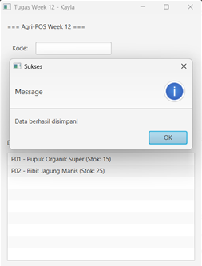
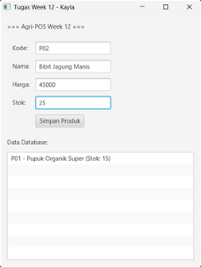
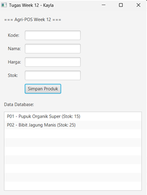

# Laporan Praktikum Minggu 12
Topik: GUI Dasar JavaFX (Event-Driven Programming) & Integrasi MVC

## Identitas
- Nama  : kayla putri arsonisr
- NIM   : 240202837
- Kelas : 3ikra

---

## Tujuan
1. Mampu membangun antarmuka grafis (GUI) sederhana menggunakan JavaFX.
2. Memahami konsep Event-Driven Programming (menangani aksi klik tombol).
3. Dapat mengintegrasikan GUI dengan backend (Service dan Repository) menggunakan arsitektur MVC.
4. Mampu merealisasikan desain diagram Bab 6 (UML) ke dalam kode program (Traceability), termasuk penerapan Dependency Inversion Principle.

---

## Dasar Teori
1. avaFX: Platform perangkat lunak untuk membuat dan mengirimkan aplikasi desktop, serta aplikasi internet yang kaya (RIA) yang dapat berjalan di berbagai perangkat.
2. Event-Driven Programming: Paradigma pemrograman di mana alur program ditentukan oleh peristiwa (events) seperti keluaran sensor, tindakan pengguna (klik mouse, ketik tombol), atau pesan dari program lain.
3. MVC (Model-View-Controller): Pola desain arsitektur yang memisahkan aplikasi menjadi tiga komponen utama:
   a. Model (Data & Logika Bisnis),
   b. View (Tampilan Antarmuka),
   c. Controller (Penghubung interaksi user dengan Model).
4. Repository Pattern: Sebuah abstraksi layer data yang memisahkan logika bisnis dari detail akses data teknis (seperti SQL).

---

## Langkah Praktikum
1. Persiapan Library: Menambahkan library JavaFX SDK dan PostgreSQL JDBC Driver ke dalam Referenced Libraries di VS Code.
2. Refactoring Kode (Traceability Bab 6):
   a. Mengubah nama interface ProdukDAO menjadi ProductRepository.
   b. Mengubah implementasi ProdukDAOImpl menjadi SqlProductRepository.
   c. Mengubah nama method insert menjadi save agar sesuai dengan Class Diagram Bab 6.
3. Implementasi MVC:
   a. View: Membuat ProductFormView.java berisi form input dan tombol.
   b. Service: Membuat ProductService.java untuk validasi bisnis dan memanggil Repository.
   c. Controller: Membuat ProductController.java untuk menangani event tombol "Simpan".
4. Wiring & Eksekusi: Menghubungkan semua komponen di AppJavaFX.java dan menjalankannya menggunakan MainLauncher.java untuk menghindari error module.

---

## Kode Program
1. Interface Repository (Sesuai Bab 6)
Java

// ProductRepository.java
public interface ProductRepository {
    // Nama method disesuaikan dengan Class Diagram: save() bukan insert()
    void save(Produk p) throws Exception;
    Produk findByCode(String code) throws Exception;
    List<Produk> findAll() throws Exception;
}

2. Service Layer (Validasi & DIP)
Java

// ProductService.java
public class ProductService {
    // Menggunakan Interface (ProductRepository), bukan class konkret (DIP)
    private final ProductRepository repository;

    public ProductService(ProductRepository repository) {
        this.repository = repository;
    }

    public void addProduct(String kode, String nama, double harga, int stok) throws Exception {
        // Validasi Bisnis (Activity Diagram)
        if (stok < 0) throw new Exception("Stok tidak boleh negatif!");
        if (harga <= 0) throw new Exception("Harga harus > 0!");
        
        // Panggil method save di Repository
        repository.save(new Produk(kode, nama, harga, stok));
    }
}

3. Controller (Event Handling)
Java

// ProductController.java
private void initController() {
    // Menangani Event Klik Tombol
    view.getBtnAdd().setOnAction(e -> simpan());
}

private void simpan() {
    try {
        // Ambil data dari GUI, kirim ke Service
        service.addProduct(
            view.getTxtKode().getText(),
            view.getTxtNama().getText(),
            Double.parseDouble(view.getTxtHarga().getText()),
            Integer.parseInt(view.getTxtStok().getText())
        );
        showAlert("Sukses", "Data berhasil disimpan!");
    } catch (Exception e) {
        showAlert("Gagal", e.getMessage());
    }
}

---

## Hasil Eksekusi
.png>)   

---

## Analisis
1. Traceability Desain ke Kode: Penerapan kode minggu ini mengikuti ketat desain UML Bab 6. Hal ini terlihat pada perubahan nama Interface menjadi ProductRepository dan method save(). Ini memastikan bahwa apa yang dirancang (Design) sinkron dengan apa yang dibangun (Implementation).
2. Tabel Traceability

| Artefak Bab 6 | Referensi Desain | Implementasi Code Week 12 | Keterangan |
| :--- | :--- | :--- | :--- |
| **Use Case** | UC-01 "Kelola Produk" (Tambah Data) | Class `ProductFormView` & `ProductController` | Form input GUI merealisasikan fitur tambah produk untuk aktor Admin/Kasir. |
| **Class Diagram** | Interface `ProductRepository` | `public interface ProductRepository` | Menggantikan nama `ProdukDAO` (dari Week 11) agar konsisten dengan desain Repository Pattern Bab 6. |
| **Class Diagram** | Method `save(Product p)` | `repository.save(p)` pada `SqlProductRepository` | Implementasi method penyimpanan data menggunakan nama yang sesuai dengan kontrak Interface. |
| **Sequence Diagram** | Alur MVC (`View` &rarr; `Controller` &rarr; `Service`) | Event `btnSimpan` &rarr; `ProductController.simpan()` &rarr; `ProductService.addProduct()` | Alur pemanggilan method mengikuti urutan sequence diagram; GUI tidak mengakses database secara langsung. |
| **Activity Diagram** | Validasi Input (Decision Node) | `ProductService`: Cek `stok < 0` atau `harga <= 0` | Logika validasi bisnis diterapkan di layer Service sebelum data diteruskan ke Repository. |
| **Principle (SOLID)** | Dependency Inversion Principle (DIP) | `private final ProductRepository repository;` di `ProductService` | Service bergantung pada abstraksi (Interface), bukan pada implementasi konkret (`SqlProductRepository`). |

3. Kendala & Solusi:
   a. Kendala: Terjadi error duplicate key value saat testing awal.
   b. Penyebab: Mencoba memasukkan kode "P01" yang sudah ada di database dari praktikum minggu lalu.
   c. Analisis: Error ini justru membuktikan koneksi database berhasil dan constraint Primary Key di PostgreSQL bekerja.
   d. Solusi: Menginput data baru dengan kode "P02".

---

## Kesimpulan
Praktikum Week 12 berhasil mentransformasi aplikasi yang tadinya berbasis Konsol (CLI) menjadi berbasis Grafis (GUI) menggunakan JavaFX. Penerapan arsitektur MVC dan Repository Pattern membuat kode menjadi modular: perubahan pada tampilan (View) tidak merusak logika bisnis (Service) atau akses data (Repository). Selain itu, integrasi dengan database PostgreSQL membuktikan bahwa data bersifat persisten (tersimpan permanen).
