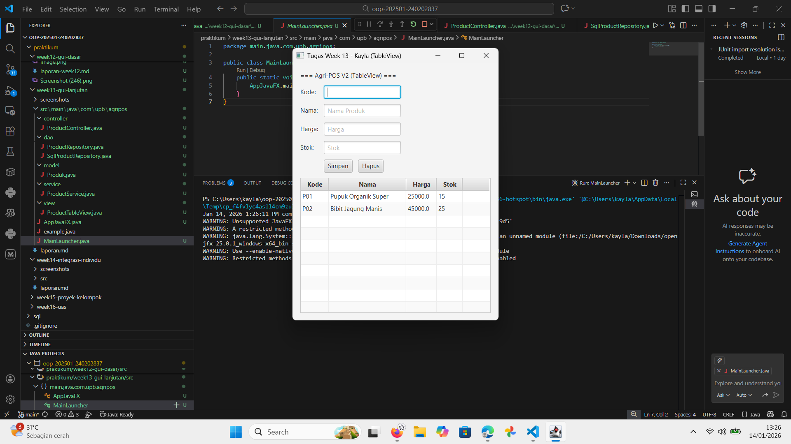
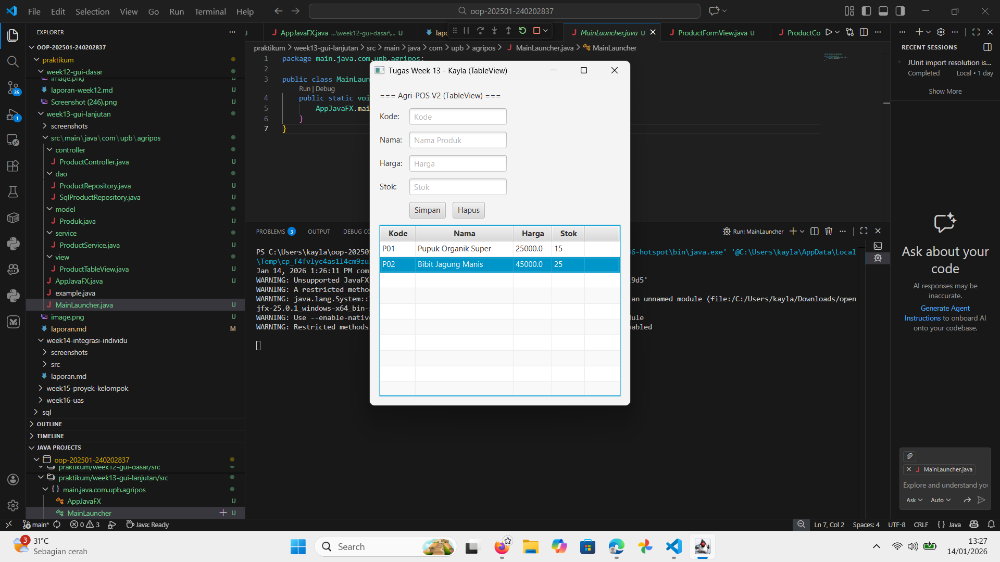
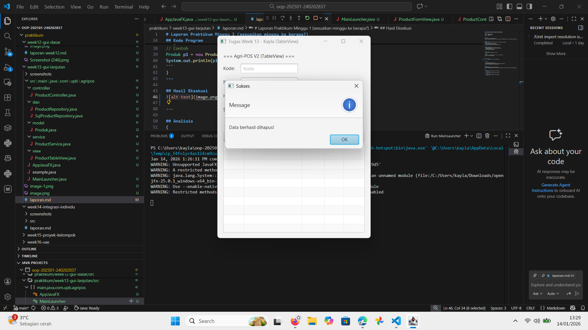
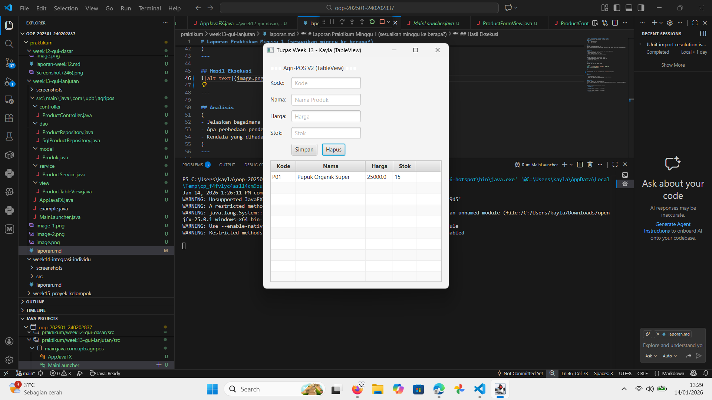

# Laporan Praktikum Minggu 13
Topik: GUI Lanjutan JavaFX (TableView & Lambda Expression)

## Identitas
- Nama  : kayla putri arsonisr
- NIM   : 240202837
- Kelas : 3ikra

---

## Tujuan
1. Mampu menampilkan data kompleks menggunakan komponen TableView pada JavaFX.
2. Memahami dan menerapkan Lambda Expression untuk menangani event (seperti klik tombol).
3. Mampu mengintegrasikan fitur Hapus Data (Delete) dari GUI hingga ke Database PostgreSQL.
4. Dapat menerapkan konsep ObservableList agar tampilan tabel selalu sinkron dengan data memori.

---

## Dasar Teori
1. TableView: Komponen JavaFX yang dirancang untuk memvisualisasikan data dalam format tabel (baris dan kolom). Setiap kolom (TableColumn) dipetakan ke properti spesifik dari objek model.
2. Lambda Expression: Fitur Java (sejak Java 8) yang memungkinkan penulisan kode anonymous class (seperti EventHandler) menjadi jauh lebih ringkas dan mudah dibaca. Contoh: button.setOnAction(e -> aksi()).
3. ObservableList: Jenis koleksi khusus di JavaFX yang memungkinkan komponen UI (seperti TableView) untuk mendeteksi perubahan data secara otomatis (tambah/hapus item) dan memperbarui tampilan secara real-time.
4. Arsitektur Layered: Pemisahan kode menjadi lapisan Presentation (View/Controller), Logic (Service), dan Data Access (Repository) untuk menjaga keteraturan dan kemudahan perawatan kode (maintainability).

---

## Langkah Praktikum
1. Persiapan Project: Membuat folder week13-gui-lanjutan dan menyalin struktur dasar dari minggu sebelumnya.
2. Update Repository: Menambahkan method delete() pada interface ProductRepository dan implementasi SQL DELETE pada SqlProductRepository.
3. Update Service: Menambahkan logika bisnis deleteProduct() pada ProductService untuk menghubungkan Controller dengan Repository.
4. Refactoring View: Mengganti komponen ListView (teks baris) menjadi TableView (tabel kolom) pada file ProductTableView.java, serta menambahkan kolom Kode, Nama, Harga, dan Stok.
5. Implementasi Controller: Mengupdate ProductController untuk menangani tombol "Hapus" menggunakan Lambda Expression dan memuat data ke dalam tabel menggunakan ObservableList.
6. Wiring & Running: Menghubungkan semua komponen di AppJavaFX.java dan menjalankannya melalui MainLauncher.

---

## Kode Program
1. View: Implementasi TableView (ProductTableView.java)
Java

// Membuat kolom tabel dan memetakannya ke atribut Produk
tableView = new TableView<>();
TableColumn<Produk, String> colNama = new TableColumn<>("Nama");
colNama.setCellValueFactory(new PropertyValueFactory<>("nama"));
// ... (kolom lainnya)
tableView.getColumns().addAll(colKode, colNama, colHarga, colStok);

2. Controller: Lambda Expression & Delete Logic (ProductController.java)
Java

// Event Handling menggunakan Lambda Expression
view.getBtnDelete().setOnAction(e -> {
    Produk selected = view.getTableView().getSelectionModel().getSelectedItem();
    if (selected != null) {
        hapus(selected.getKode()); // Panggil method hapus
    } else {
        showAlert("Peringatan", "Pilih produk di tabel dulu!");
    }
});

3. Repository: Eksekusi SQL Delete (SqlProductRepository.java)
Java

@Override
public void delete(String code) throws Exception {
    String sql = "DELETE FROM products WHERE code = ?";
    try (PreparedStatement ps = connection.prepareStatement(sql)) {
        ps.setString(1, code);
        ps.executeUpdate();
    }
}

---

## Hasil Eksekusi
   

---

## Analisis
1. Analisis Kode: Pada praktikum ini, pendekatan tampilan diubah total dari ListView menjadi TableView. TableView memerlukan pemetaan data yang lebih ketat menggunakan PropertyValueFactory, yang mengambil nilai dari getter class Model (Produk). Selain itu, penggunaan Lambda Expression pada ProductController meringkas penulisan event handler dari 5-6 baris (jika pakai Anonymous Inner Class) menjadi 1 baris kode saja.
2. Traceability

Tabel berikut menunjukkan pemetaan antara Desain UML pada Bab 6 dengan Implementasi Kode Program pada Praktikum Minggu 13 (GUI Lanjutan):

| Artefak Bab 6 | Referensi Desain | Implementasi Code Week 13 | Keterangan |
| :--- | :--- | :--- | :--- |
| **Use Case** | UC-02 "Lihat Daftar Produk" | Method `loadData()` & `ObservableList` | Data diambil dari Database via Service, lalu ditampilkan menggunakan komponen `TableView` (bukan ListView lagi). |
| **Use Case** | UC-03 "Hapus Produk" | Tombol `btnDelete` dengan *Lambda Expression* | Fitur hapus direalisasikan. Event handler memanggil `service.deleteProduct(code)` untuk menghapus data permanen. |
| **Sequence Diagram** | SD-02 "Alur Hapus Produk" | `View` &rarr; `Controller` &rarr; `Service` &rarr; `Repository` | Urutan pemanggilan kode mengikuti ketat sequence diagram. GUI tidak mengakses Database secara langsung. |
| **Class Diagram** | Interface `ProductRepository` | Method `delete(String code)` | Penambahan method `delete` pada Interface dan Implementasi `SqlProductRepository` sesuai kontrak desain. |
| **Activity Diagram** | Validasi Hapus | Logika `if (selected != null)` pada Controller | Sistem memvalidasi apakah user sudah memilih baris tabel sebelum melakukan proses hapus. |

3. Kendala & Solusi:
   a. Kendala: Saat menjalankan aplikasi, output yang muncul masih tampilan Week 12 (ListView), padahal kode Week 13 sudah diedit.
   b. Penyebab: VS Code salah mendeteksi classpath karena adanya duplikasi nama class (AppJavaFX, MainLauncher) di folder Week 12 dan Week 13 dalam satu workspace.
   c. Solusi: Melakukan isolasi folder (membuka hanya folder week13-gui-lanjutan) atau membersihkan cache Java Workspace agar VS Code menjalankan file yang benar.

---

## Kesimpulan
Praktikum Week 13 berhasil meningkatkan kualitas antarmuka aplikasi Agri-POS menjadi lebih informatif menggunakan TableView. Integrasi fitur Delete melengkapi operasi CRUD dasar (Create, Read, Delete). Penerapan Lambda Expression terbukti membuat kode Controller lebih bersih dan mudah dibaca. Secara keseluruhan, aplikasi kini memiliki fondasi GUI dan Backend yang solid sesuai standar arsitektur MVC.
