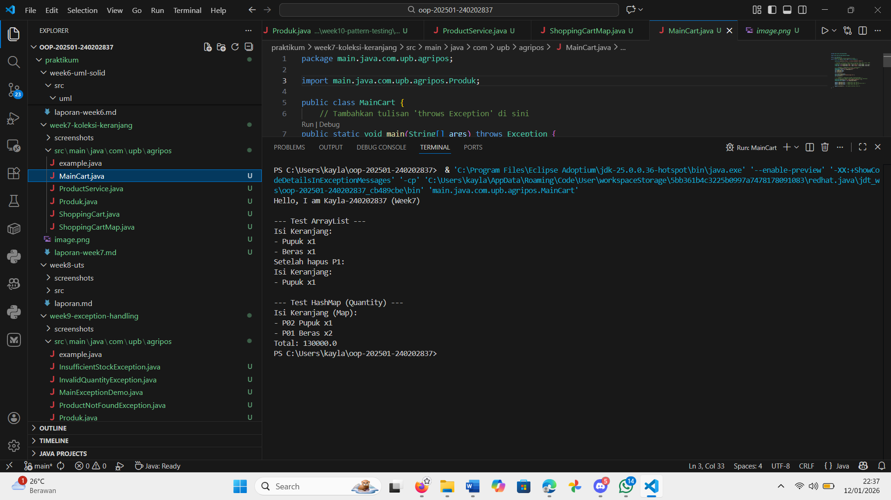
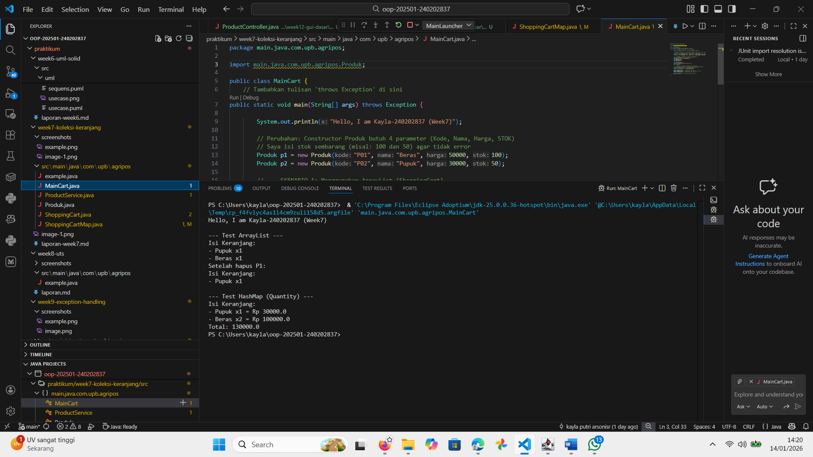

# Laporan Praktikum Minggu 7
Topik: Collections (List & Map) dan Implementasi Keranjang Belanja

## Identitas
- Nama  : Kayla putri arsonisr
- NIM   : 240202837
- Kelas : 3IKRA
---

## Tujuan
1. Memahami konsep Collection dalam Java (List, Map, Set).
2. Mampu menggunakan ArrayList untuk menyimpan objek secara dinamis.
3. Mampu mengimplementasikan HashMap untuk mengelola data dengan pasangan Key-Value (studi kasus: Quantity produk).
4. Dapat melakukan override method equals() dan hashCode() agar objek dapat digunakan sebagai Key dalam Map.
---

## Dasar Teori
1. Java Collections Framework: Menyediakan arsitektur standar untuk menyimpan dan memanipulasi grup objek. Interface utamanya meliputi List, Set, dan Map.
2. ArrayList (List): Struktur data yang menyimpan elemen secara berurutan (ordered collection) dan mengizinkan duplikasi data. Akses data cepat menggunakan indeks.
3. HashMap (Map): Struktur data yang menyimpan data dalam pasangan Key dan Value. Key harus unik. Sangat efisien untuk pencarian data atau pengelompokan.
4. equals() & hashCode(): Dua method penting yang harus di-override ketika sebuah objek kustom (seperti Produk) digunakan sebagai Key dalam HashMap atau dimasukkan ke HashSet. Tanpa ini, dua objek dengan data sama akan dianggap berbeda.

---

## Langkah Praktikum
1. Modifikasi Model Produk: Menambahkan method equals() dan hashCode() pada file Produk.java yang sudah ada dari minggu sebelumnya, agar kompatibel dengan HashMap.
2. Implementasi ArrayList: Membuat class ShoppingCart untuk menampung produk dalam bentuk list sederhana.
3. Implementasi HashMap: Membuat class ShoppingCartMap untuk menampung produk dengan logika quantity (jika barang sama dimasukkan, jumlah bertambah, bukan membuat baris baru).
4. Uji Coba: Membuat class MainCart untuk mensimulasikan transaksi belanja, menghapus produk, dan memvalidasi perhitungan total harga.
5. Commit & Push: Mengunggah kode ke repository Git dengan pesan commit yang sesuai.

---

## Kode Program
1. Modifikasi Produk.java (Menambah equals & hashCode)
Java

// Import yang ditambahkan
import java.util.Objects;

// Method tambahan di dalam class Produk
@Override
public boolean equals(Object o) {
    if (this == o) return true;
    if (o == null || getClass() != o.getClass()) return false;
    Produk produk = (Produk) o;
    return Objects.equals(kode, produk.kode);
}

@Override
public int hashCode() {
    return Objects.hash(kode);
}

2. ShoppingCartMap.java (Logika Quantity)
Java

public class ShoppingCartMap {
    private final Map<Produk, Integer> items = new HashMap<>();

    public void addProduct(Produk p) {
        // Jika produk sudah ada, value (qty) ditambah 1. Jika belum, set 1.
        items.put(p, items.getOrDefault(p, 0) + 1);
    }

    public double getTotal() {
        double total = 0;
        for (Map.Entry<Produk, Integer> entry : items.entrySet()) {
            // Harga * Quantity
            total += entry.getKey().getHarga() * entry.getValue();
        }
        return total;
    }
// ... (method printCart dan removeProduct lainnya)
}

3. MainCart.java (Skenario Pengujian)
Java

public class MainCart {
    public static void main(String[] args) {
        System.out.println("Hello, I am Kayla-240202837 (Week7)");

        // Membuat objek produk dengan stok awal
        Produk p1 = new Produk("P01", "Beras", 50000, 100);
        Produk p2 = new Produk("P02", "Pupuk", 30000, 50);

        // Test HashMap (Skenario Quantity)
        System.out.println("\n--- Test HashMap (Quantity) ---");
        ShoppingCartMap mapCart = new ShoppingCartMap();
        
        mapCart.addProduct(p1); // Beras (qty 1)
        mapCart.addProduct(p1); // Beras (qty jadi 2)
        mapCart.addProduct(p2); // Pupuk (qty 1)
        
        mapCart.printCart(); 
    }
}

---

## Hasil Eksekusi
 

---

## Analisis
1. Mekanisme Kode: Pada bagian HashMap, program berhasil mendeteksi bahwa input p1 (Beras) yang dimasukkan dua kali adalah objek yang sama. Hal ini terlihat di output: - P01 Beras x2 dengan total harga 130.000 (50rb x 2 + 30rb).
2. Integrasi Kode Lama: Tantangan utama minggu ini adalah menggunakan file Produk.java dari minggu sebelumnya yang menggunakan Bahasa Indonesia (getHarga, stok) dengan modul baru. Penyesuaian dilakukan dengan mengganti pemanggilan method getter dan menyesuaikan constructor di MainCart.
3. Pentingnya hashCode: Sebelum method equals dan hashCode ditambahkan, HashMap menganggap dua input "Beras" sebagai key yang berbeda, sehingga muncul dua baris terpisah. Setelah method tersebut ditambahkan, HashMap membandingkan konten (kode produk) alih-alih alamat memori, sehingga fitur quantity berfungsi.

---

## Kesimpulan
Praktikum ini memberikan pemahaman bahwa pemilihan tipe Collection sangat mempengaruhi efisiensi program.

   1. ArrayList cocok untuk daftar sederhana yang urutannya penting.
   2. HashMap jauh lebih unggul untuk kasus keranjang belanja nyata yang membutuhkan pengelompokan item (quantity) dan pencarian cepat berdasarkan ID produk.
   3. Pemahaman tentang Override method bawaan Java (equals, hashCode) sangat krusial dalam struktur data Map.

---

## Quiz
1. Jelaskan perbedaan mendasar antara List, Map, dan Set!
Jawaban:
   a. List: Terurut (ordered) dan boleh ada data duplikat.
   b. Set: Himpunan unik (tidak boleh duplikat) dan biasanya tidak terurut.
   c. Map: Menyimpan data dalam pasangan Key-Value, di mana Key harus unik.
2. Mengapa ArrayList cocok digunakan untuk keranjang belanja sederhana?
Jawaban: Karena implementasinya mudah, mendukung penambahan data dinamis, dan urutan barang yang dimasukkan pembeli tetap terjaga (FIFO - First In First Out) sesuai urutan input.
3. Bagaimana struktur Set mencegah duplikasi data?
Jawaban: Set menggunakan mekanisme hashing. Saat data masuk, ia mengecek kode hash; jika sama, ia membandingkan objek dengan equals(). Jika terbukti sama, data baru ditolak.
4. Kapan sebaiknya menggunakan Map dibandingkan List? Jelaskan dengan contoh!
Jawaban: Map digunakan saat kita butuh akses data spesifik berdasarkan kunci unik atau perlu pengelompokan. Contoh: Menghitung jumlah kata dalam kalimat (Kata sebagai Key, Jumlah sebagai Value) atau keranjang belanja dengan quantity (Produk sebagai Key, Jumlah Beli sebagai Value).