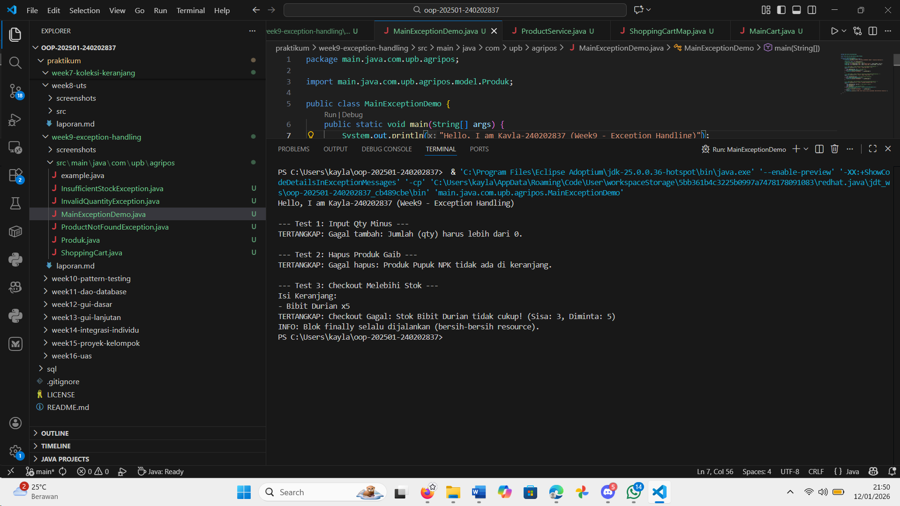

# Laporan Praktikum Minggu 9
Topik: Exception Handling, Custom Exception, dan Penerapan Design Pattern

## Identitas
- Nama  : Kayla putri arsonisr
- NIM   : 240202837
- Kelas : 3IKRA

---

## Tujuan
1. Mampu menjelaskan perbedaan antara Error dan Exception.
2. Mampu mengimplementasikan blok try-catch-finally untuk menangani kesalahan program.
3. Mampu membuat Custom Exception untuk validasi logika bisnis (stok kurang, quantity tidak valid).
4. Mampu mengintegrasikan penanganan error ke dalam sistem Agri-POS.
---

## Dasar Teori
1. Error vs Exception:
   a. Error adalah masalah fatal di tingkat sistem (JVM) yang sulit dipulihkan, contohnya OutOfMemoryError. Program biasanya harus berhenti jika ini terjadi.
   b. Exception adalah kondisi tidak normal dalam logika program yang dapat ditangkap dan ditangani agar program tidak crash, contohnya NullPointerException atau ArithmeticException.
2. Struktur Try-Catch-Finally:
   a. try: Blok kode yang berpotensi menyebabkan error.
   b. catch: Blok untuk menangkap dan menangani error jika terjadi.
   c. finally: Blok yang selalu dijalankan, baik terjadi error maupun tidak (biasanya digunakan untuk membersihkan memori atau menutup koneksi).
3. Custom Exception: Kita dapat membuat class exception sendiri dengan mewarisi (extends) class Exception untuk merepresentasikan kesalahan spesifik dalam bisnis, misalnya StokHabisException.

---

## Langkah Praktikum
1. Membuat Custom Exception: Membuat tiga file exception baru (InvalidQuantityException, ProductNotFoundException, InsufficientStockException) yang mewarisi class Exception.
2. Update ShoppingCart: Memodifikasi method addProduct, removeProduct, dan checkout pada ShoppingCart.java untuk melakukan validasi. Jika data tidak valid (misalnya jumlah beli <= 0), program akan melempar (throw) custom exception.
3. Membuat Main Tester: Membuat file MainExceptionDemo.java untuk menguji skenario error menggunakan blok try-catch.
4. Uji Coba: Menjalankan program untuk memastikan pesan error muncul sesuai harapan tanpa menghentikan aplikasi secara paksa.

---

## Kode Program
1. Custom Exceptions (Contoh: InvalidQuantityException)
Java

package com.upb.agripos;
public class InvalidQuantityException extends Exception {
    public InvalidQuantityException(String message) {
        super(message);
    }
}

2. ShoppingCart.java (Bagian Checkout dengan Validasi)
Java

public void checkout() throws InsufficientStockException {
    for (Map.Entry<Produk, Integer> entry : items.entrySet()) {
        Produk product = entry.getKey();
        int qtyDiKeranjang = entry.getValue();

        // Validasi Stok menggunakan method dari Produk.java
        if (product.getStok() < qtyDiKeranjang) {
            throw new InsufficientStockException(
                "Checkout Gagal: Stok " + product.getNama() + " tidak cukup!"
            );
        }
    }
    // Jika aman, kurangi stok
    for (Map.Entry<Produk, Integer> entry : items.entrySet()) {
        entry.getKey().kurangiStok(entry.getValue());
    }
    items.clear();
}

3. MainExceptionDemo.java (Uji Coba Try-Catch)
Java

// Test 3: Checkout Melebihi Stok
try {
    cart.addProduct(p1, 5); // Stok cuma 3, minta 5
    cart.checkout(); 
} catch (InvalidQuantityException | InsufficientStockException e) {
    System.err.println("TERTANGKAP: " + e.getMessage());
} finally {
    System.out.println("INFO: Blok finally selalu dijalankan.");
}

---

## Hasil Eksekusi

---

## Analisis
1. Alur Program: Pada percobaan pertama, saya memasukkan quantity -5. Sistem di ShoppingCart mendeteksi ini dan langsung melempar InvalidQuantityException. Di MainExceptionDemo, blok catch menangkap sinyal ini dan mencetak pesan "TERTANGKAP..." alih-alih menghentikan program dengan error merah (stack trace).
2. Validasi Stok: Pada percobaan ketiga, saat melakukan checkout barang melebihi stok, InsufficientStockException aktif. Ini membuktikan logika bisnis keranjang belanja berjalan aman. Stok tidak akan menjadi minus.
3. Perbedaan dengan Week 7: Minggu lalu, jika terjadi error logika, program mungkin lanjut saja (menghasilkan data aneh) atau langsung berhenti mendadak. Minggu ini, program lebih robust (tahan banting) karena semua kemungkinan error sudah diprediksi dan ditangani.

---

## Kesimpulan
Penerapan Exception Handling sangat krusial dalam pengembangan aplikasi profesional. Dengan menggunakan try-catch dan Custom Exception, kita dapat:
   1. Mencegah aplikasi berhenti mendadak saat pengguna melakukan kesalahan input.
   2. Memberikan pesan error yang lebih manusiawi dan spesifik (misalnya: "Stok kurang", bukan sekadar "Error").
   3. Menjaga integritas data agar stok produk tidak bernilai negatif.

---

## Quiz
1. Jelaskan perbedaan error dan exception.
Jawaban: Error adalah kondisi fatal sistem yang sulit ditangani (contoh: RAM penuh), sedangkan Exception adalah kesalahan logika program yang bisa ditangkap dan diperbaiki saat runtime (contoh: Salah input).
2. Apa fungsi finally dalam blok try–catch–finally?
Jawaban: Blok finally menjamin kode di dalamnya (seperti penutupan koneksi database) selalu dieksekusi, terlepas dari apakah error terjadi atau tidak di blok try.
3. Mengapa custom exception diperlukan? 
Jawaban: Karena Exception bawaan Java (seperti IllegalArgumentException) terlalu umum. Custom Exception (seperti InsufficientStockException) memberikan konteks yang jelas tentang apa yang salah dalam logika bisnis aplikasi kita.
4. Berikan contoh kasus bisnis dalam POS yang membutuhkan custom exception. 
Jawaban:
    a. ProductExpiredException: Saat kasir mencoba scan barang kadaluarsa.
    b. PaymentDeclinedException: Saat pembayaran kartu kredit ditolak.
    c. MemberInactiveException: Saat diskon member tidak bisa dipakai karena kartu mati.
